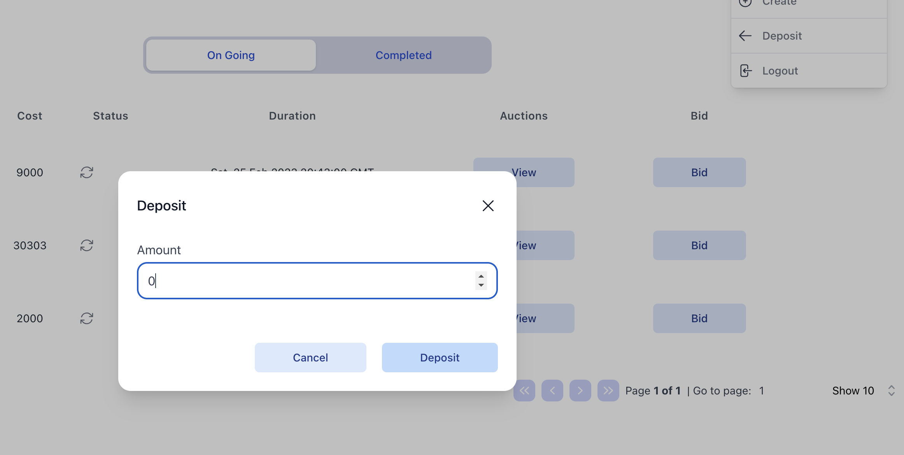
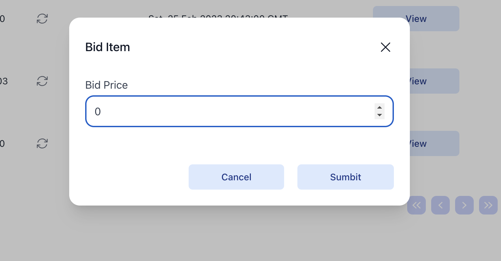
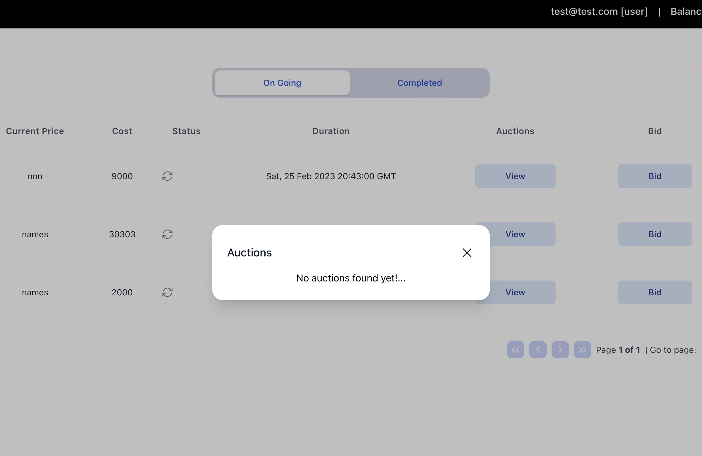
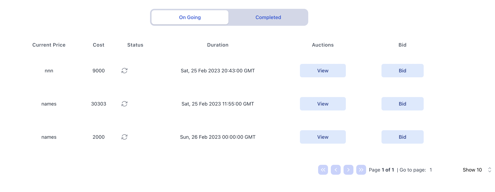

# AuctionNx

## Description

Auction is a simple auction application that allows users to create auctions, bid on auctions, and view the status of their auctions.

## Installation

Install dependencies:

```npm
  npm install
```

To run the apps:

For frontend app
```npm
  npm run serve-fe
```
or (require `nx` cli installed) 
```npm
  nx serve auction
```

For backend app:
- Install latest `redis`
- Start `redis-server` locally, or use docker to run your redis service
- Install postgres:
```npm
  brew install postgresql@14
```
- Now run up a service for postgresql, which will hold our DB instance
```npm
  brew service start postgresql@14
```
- Check the `DATABASE_URL` in the `.env` file, it will point to your local DB, change it as your need.
- Run `npm run prisma:migrate-dev` to for DB migration. After this step we are good to go.
- Now to run the BE app up
```npm
  npm run serve-be
```
or (require `nx` cli installed)
```npm
  nx serve auction-be
```

Or if you want to run both BE and FE in 1 command, simple run this:

```npm
 npm run serve
```

For available APIs, can view it via swagger:
`http://localhost:3333/api/v1/jitera/docs`


## Usage

1. To deposit funds, hover on the profile icon and click on the "Deposit" button. 
#### 

&nbsp;

2. To create a new auction, hover on the profile icon and click on the "Create" button.
#### 

&nbsp;

3. To bid on an auction, click on the "Bid" butto on the table.
#### 

&nbsp;

4. To view the details of an auction, click on the "View" button on the table.
#### 

&nbsp;


5. To view "On Going" or "Completed" auctions, click on the "On Going" or "Completed" tab on the table.
#### 

## Contributing

1. Fork it 
2. Create your feature branch 
3. Commit your changes 
4. Push to the branch 
5. Create a new Pull Request


