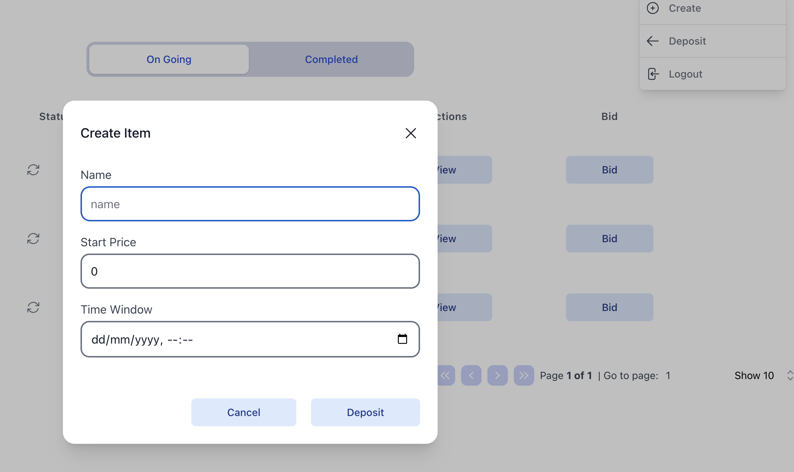

# AuctionNx

## Description

Auction is a simple auction application that allows users to create auctions, bid on auctions, and view the status of their auctions.

## Installation

Add this line to your application's:

```npm
 npm install
```

And then execute:
1.  run a local or docker postgres database and change the DATABASE_URL in the .env file to point to the database.
2.  run a redis server or ignore it
3. run the following command to create the database tables:

```npm
 npm run prisma:migrate-dev
``` 

```npm
 npm run serve
```


## Usage

1. To deposit funds, hover on the profile icon and click on the "Deposit" button. 
#### 

&nbsp;

2. To create a new auction, hover on the profile icon and click on the "Create" button.
#### 

&nbsp;

3. To bid on an auction, click on the "Bid" butto on the table.
#### 

&nbsp;

4. To view the details of an auction, click on the "View" button on the table.
#### 

&nbsp;


5. To view "On Going" or "Completed" auctions, click on the "On Going" or "Completed" tab on the table.
#### 

## Contributing

1. Fork it 
2. Create your feature branch 
3. Commit your changes 
4. Push to the branch 
5. Create a new Pull Request


